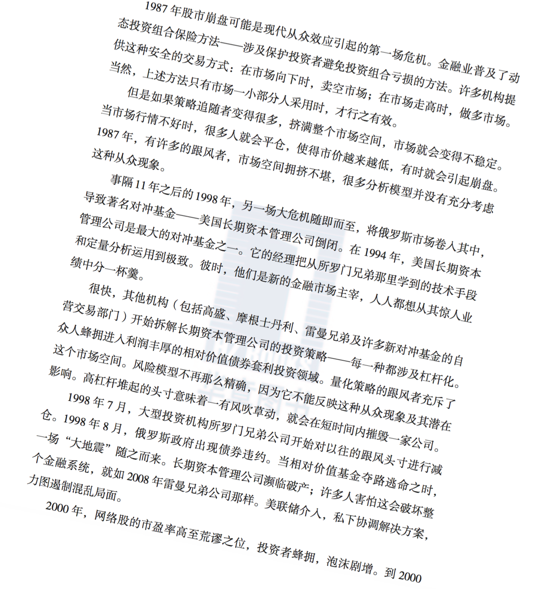
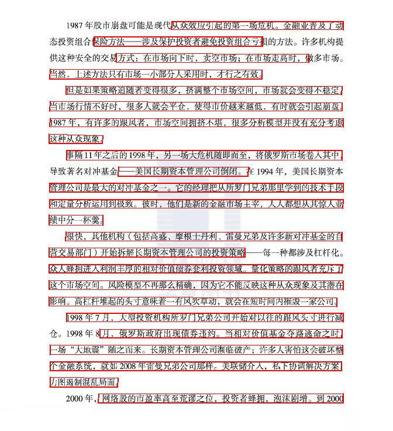

上学期的期末作业，win10平台的OCR

缝合了huoyijie的AdvancedEAST还有xiaofengShi的CHINESE-OCR

分别做文本检测和文本识别

部分文档：
## 6.1. 效果
- 输入：



- 检测结果：



- 识别结果：

>从众效应可起的第一场危机。金融业普八了动  
呆险方法  涉及傈护投资者避免投资组合亏椤  
,方式:在市场向下时，卖空市场:在市场走高时，伺  
当然，上述方法只有市场一小部分人采用时，才行之有效。  
但是如果策路追陋者变得很多，挤满整个市场空问，市场就会变得不椤定。  
当市行情不好时，很多人就会平仓，使得市价越来越低，有时就会引起瘸盎。  
1087年，有许多的眼风者，市场空间拥挤不堪，很多分析模型并没有充分考虑  
这种从众现象。  
事隔11年之后的1998年，另一场大危机随即而至，将俄罗斯市场卷人其中  
  美国长期资本管理公司倒闭。  
管理公司是最大的对冲基金之一。它的经理把从所罗门兄弟那里学到的技术手段  
和定量分析运用到极致。彼时，他们是新的金融市场主宰，人人都想从其惊人业  
绩中分一杯拳。  
很快，其他机构 包括高盛、廖根士丹利、雷晏兄弟及许多新对冲基金的自  
营交易部门]>开始拆解长期资本管理公司的投资策略  
众人蜂拥进人利润丰厚的相对价值傍券套利投资领域。量化策路的跟风者充斥了  
这个市场空间。风险模型不再那么精确，因为它不能反映这种从众现象及其潜在  
影响。高杠杆堆起的头寸意味着一有风吹草动，就会在短时间内椤毁一家公司。  
1908年7月，大型投资机构所罗门兄弟公司开始对以往的跟风头寸进行诚  
月，俄罗斯政府出现债券违约。当相对价值基金夺路逃命之时，  
一场“大地震”随之而来。长期资本管理公司濒临破产;许多人害怕这会破坏整  
个金融系统，就如2008年富晏兄弟公司郑样。美联储介人，私下协调解决方案  
力图遏制混乱局面。  
网络股的市盈率高至荒谬之位，投资者鲶捌，泡汴剧增。到2000  

- 切割法识别结果

>:1087年股市瘸盎可能是现代从众效应亏起的第一场危机。金融业普及了动  
:态投资组合傈险方法   涉及傈护投资者避免投资组合亏损的方法。许多机构提  
:代这种安全的交易方式:在市场向下时，卖空市场;在市场走高时，做多市场。  
:当然，上述方法只有市场一小部分人采用时，才行之有效。  
:但是如果策路追随者变得很多，挤满鲶个市场空间，市场就会变得不稳定。  
:当市场行情不好时，很多人就会平仓，使得市价越来越低，有时就会亏I起瘸盎。  
1987年，有许多的眼风者，市场空间拥挤不堪，很多分析嫉型并没有充分考虑  
这种从众现象。  
事11年之后的1908年，另一场大危机陂即而至，将俄罗斯市场卷人其中,  
导致著绍对冲基金   美国长期资本管理公司倒闭。在1004年，美国长期资本  
:管理公司是最大的对冲基金之一。它的经理把从所罗门]兄弟科里学到的技术手段  
和定量分析运用到极致。彼时，他们是新的金融市场主宰，人人都椤从其惊人业  
:绩中分一杯驽。  
很快，其他机构 包括高廖、廖根士忖利、管晏兄弟及许多新对冲基金的自  
:营交易部门]>开始拆解长期资本管理公司的投资策略   每一种都汴及汇杆化。  
众人蜂拥进人利润丰厚的相对价值傍券委利投资领域。量化策路的跟风者充斥了  
这个市场空间。风险模型不再那么将确，因为它不能反腴这科从众现象及其潜在  
影响。高杠杆堆起的头寸意味着一有风吹草动，就会在短时间内摧毁一家公司]。  
1908年7月，大型投资机构所罗门]兄弟公司开始对以往的跟风头寸进行诚  
:企。1008年8月，俄罗斯政府出现债券违绚。当相对价值基金夺路逃命之时，  
:一场“大地震”随之而来。长期资本管理公司濒临破产;许多人害怕这会破坏整  
个金融系统，就如2008年雷晏兄弟公司那样。美联傍介人，私下协调解决方案，  
:力图退制混乱局面。  
:2000年，网络股的市盈率高至荒谬之位，投资者鲶捌，泡汴剧增。到2000  

## 6.2. 模型使用方法
### 6.2.1. 项目的结构
>my_ocr ***->主目录***
>>OCR_APP ***->项目核心***
>>>AdvancedEAST ***->AdvancedEAST模型***  
crnn_ctc ***->crnn+ctc模型***  
test_imgs ***->用于测试的图片***  
tmp  ***->文本识别的临时文件, AdvancedEAST***  
tmp_cut  ***->文本识别的临时文件，切割法***  
interface.py ***->python3实现的OCR接口***  
>>test.py ***->接口用法示例***  
>
>>cmd_test.py ***->命令行接口， 与web配合使用***
>
>>web_test.py ***->flask实现， 网页测试，启动后访问http://127.0.0.1，上传图片后的加载非常慢，仅用于测试！***
>
>>static ***web 静态资源***  
>
>>templates ***web html模板***  
>
>>Test ***->几种方法的测试***

### 6.2.2. 使用方法
- 将vgg16模型置于keras模型目录下
  - 在Windows平台下为C:\Users\\{用户名}\\.keras\models
  - 这里的{用户名}为项目所在Windows平台当前用户的用户名
  - 如果网速快可以跳过这一步，keras会自行下载模型
- 参照test.py中的用法
  - 导入项目接口

	>```python
	>from OCR_APP.interface import my_ocr
	>```
  - 传入待识别的图片路径，获取识别结果，该结果为一个python字典
	>```python
	>result = my_ocr(img_path)
	>```
	同时会在图片所在文件夹下生成文本检测框选结果:  
	img_path+'_adjusted.jpg' 为矫正后的文本  
	img_path+'_adjusted.jpg\_act.jpg' 为AdvancedEAST的文本预选框示意图  
	img_path+'_adjusted.jpg\_predict.jpg' 为AdvancedEAST的最终框选结果示意图  
	img_path+'_adjusted.txt' 描述了每个文本框的坐标

### 6.2.3. 训练
- AdvancedEAST
  - 数据集 tianchi ICPR dataset
  - 进入AdvancedEAST目录
  - 根据cfg.py设置解压数据集，并设置文件夹名称
  - python preprocess.py
  - python label.py
  - python advanced_east.py ***->模型将保存在AdvancedEAST/saved_model下***

- crnn+ctc
  - 进入crnn_ctc/train/keras-train目录
  - python trainbatch.py ***->Windows平台貌似不支持，建议使用Linux平台进行训练***


# 7. 参考文献
[1] https://cloud.tencent.com/developer/article/1030422 历史  
[2] https://www.cnblogs.com/zxy-joy/p/10687152.html 切割法  
[3] https://blog.csdn.net/zhu_hongji/article/details/81480400 形态学操作法  
[4] https://www.jianshu.com/p/b5af24e2f9ff MSER+NMS  
[5] Zhi Tian, Weilin Huang, Tong He, Pan He and Yu Qiao. Detecting Text in Natural Image with Connectionist Text Proposal Network. In *ECCV*, 2016.  
[6] https://my.oschina.net/u/876354/blog/3047851 CTPN  

[7] https://blog.csdn.net/bestrivern/java/article/details/100889632 CTPN

[8] https://zhuanlan.zhihu.com/p/49588885 CTPN

[9] https://zhuanlan.zhihu.com/p/34757009 CTPN

[10] https://www.cnblogs.com/Allen-rg/p/11712703.html LSTM  

[11] Baoguang Shi, Xiang Bai and Cong Yao. An End-to-End Trainable Neural Network for Image-based Sequence Recognition and Its Application to Scene Text Recognition. 2015.

[12] https://my.oschina.net/u/876354/blog/3050127 EAST

[13] https://blog.csdn.net/gdhy9064/article/details/102646978 keras验证码识别模型

[14] https://github.com/huoyijie/AdvancedEAST AdvancedEAST

[15] https://github.com/xiaofengShi/CHINESE-OCR CHINESE-OCR
